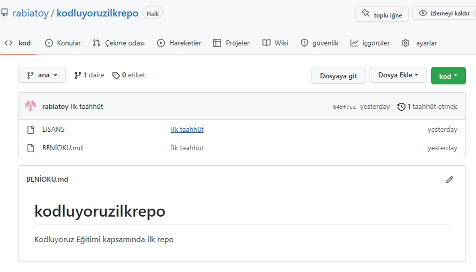

# Kodluyoruz İlk Repo
Bu repo Kodluyoruz Front-End Eğitiminde oluşturduğumuz ilk repo. İçerisinde bir adet README dosyası, bir adet de index.html barındırıyor.

# Installation
Öncelikle projeyi clonlayın. 

git clone https://github.com/rabiatoy/kodluyoruzilkrepo.git

# Usage 
Projeyi cloneladıktan sonra Visual Studio Code programında açınız.

# Contributing
Pull requestler kabul edilir. Büyük değişikler için, lütfen önce neyi değiştirmek istediğinizi tartışmak için bir konu açınız...

# License
[MIT](https://choosealicense.com/licenses/mit/)

